# React Native Reanimated 2

이 프로젝트는 유튜브 채널 [Reactiive](https://www.youtube.com/channel/UCaUilVZamr6K-dAdUt_e6Lw) 의 영상을 바탕으로 스터디를 진행한 내용을 담고 있습니다.

## Reactiive

### intro
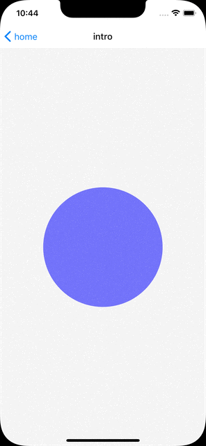

### pan-gesture-handler
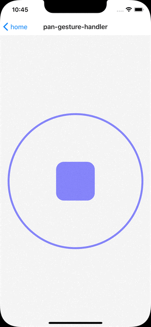

### animated-scroll-view
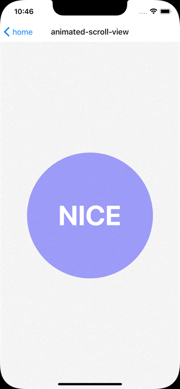

### interpolate-colors
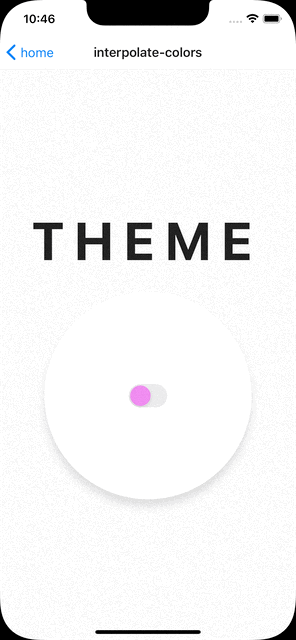

### pinch-gesture-handler
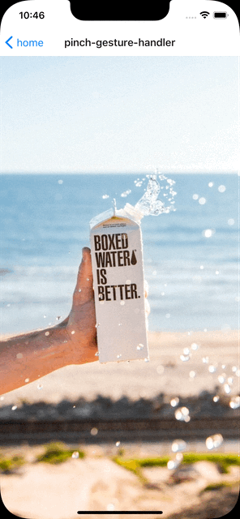

### tap-gesture-handler
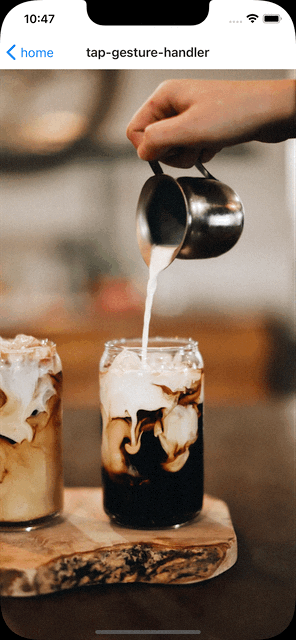

### scroll-view-implementation
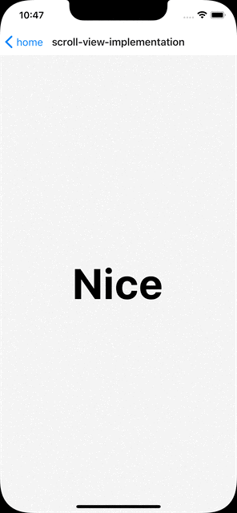

### color-picker
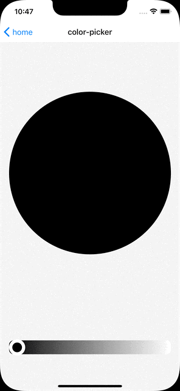

### svg-and-text
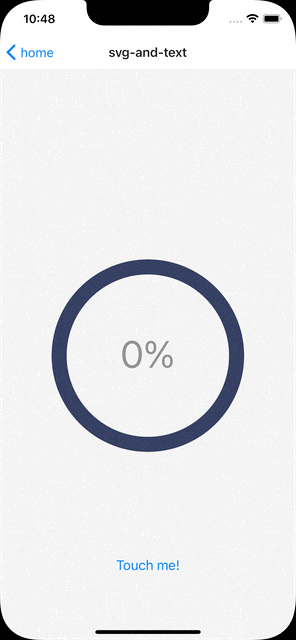

### swipe-to-delete
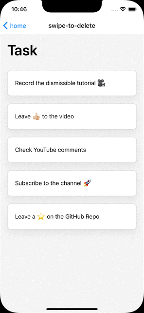

### ripple
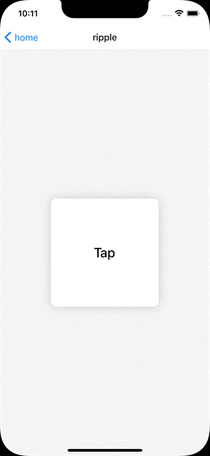

### perspective-menu
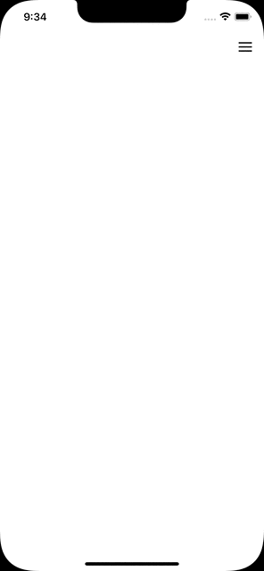

---------------------------------------------------------------------------

### 주의사항

#### 타입에러
react 18 배포와 함께 `@types/react` 버전이 18로 올라감에 따라 기존 라이브러리와 타입 충돌 [이슈](https://github.com/DefinitelyTyped/DefinitelyTyped/issues/59765) 가 있습니다.

현재 `@types/react-native` 의존성은 아래와 같습니다.
```json
{
  "dependencies": {
    "@types/react": "*"
  }
}
```

`package.json` 에 `@types/react` 에 대한 resolution 설정으로 해결하였습니다.
```json
{
  "resolutions": {
    "@types/react": "~17.0.21"
  }
}
```

#### react native debugger 버전
```json
{
  "resolutions": {
    "react-devtools-core": "4.14.0"
  }
}
```
